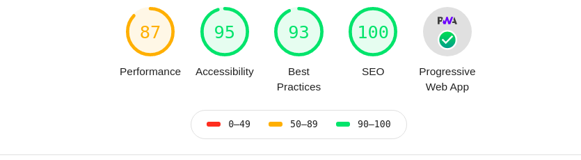

# My Portfolio

## 

This project is original from [EmaSuriano](https://github.com/EmaSuriano/gatsby-starter-mate)  
The changes are use for my personal purpose only

## [Check the Site ✨](https://happy-heyrovsky-08c95c.netlify.com/)

### Lighthouse Score 💯

<h3>Full report can be seen <a href="media/www.thuykafe.com-20200304T132032.html" alt="Full Lighthouse Report">here</a></h3>

## License 📝

MIT.
